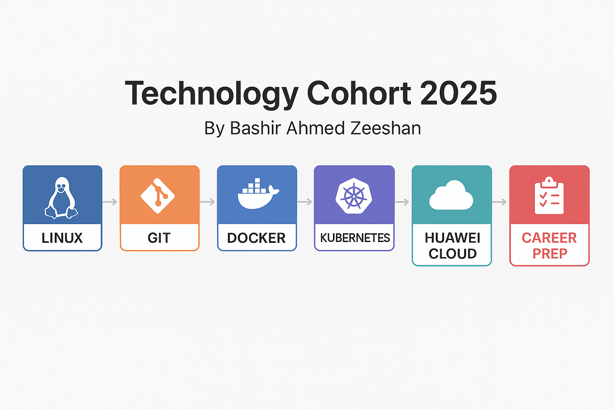

# 📘 Technology Cohort 2025  

  

> 🚀 A **free, community-based initiative** offering weekly live sessions, hands-on projects, and peer learning on Linux, Docker, Kubernetes, Cloud, Git, System Design, LinkedIn growth, and Interview Prep.  

---

## ✨ What is Tech Cohort 2025?  

Technology Cohort 2025 is a **community learning program** where we come together to:  
- ✅ Learn real-world technologies through **weekly live interactive sessions**  
- ✅ Work on **hands-on projects with personalized feedback**  
- ✅ Share, collaborate, and grow in a **supportive peer community**  
- ✅ Prepare for **technical interviews and professional growth**  

And the best part: **It’s 100% FREE** 🎉  

---

## 📂 Topics Covered  

We focus on the most in-demand tech & career skills:  

- 🐧 [Linux Basics](./topics/linux/README.md)  
- 🔗 [Git & Collaboration](./topics/git/README.md)  
- 🐳 [Docker & Containerization](./topics/docker/README.md)  
- ⚓ [Kubernetes](./topics/kubernetes/README.md)  
- ☁️ [Huawei Cloud](./topics/huawei-cloud/README.md)  
- 🏗️ [System Design](./topics/system-design/README.md)  
- 🌐 [LinkedIn Growth](./topics/linkedin-growth/README.md)  
- 🎯 [Interview Preparation](./topics/interview-prep/README.md)  
----

👥 𝐖𝐡𝐨’𝐬 𝐁𝐞𝐡𝐢𝐧𝐝 𝐓𝐡𝐢𝐬?
This initiative is led by [BASHIR AHMED ZEESHAN](https://www.linkedin.com/in/bashirahmedzeeshan/), a Cloud & DevOps Consultant with experience in training professionals on Linux, Cloud, Kubernetes, and more. Having mentored hundreds of learners, Zeeshan believes in community-first learning that prepares you for the real world.

---

## 🛠️ Getting Started  

### 🔗 Technology Cohort Links   
👉 [**Website**](https://baztechknow.com/technology-cohort-2025)  

🧑‍💻[**YouTube Playlist**](https://www.youtube.com/playlist?list=PLMxmGV3YVXCKoeptvRHmGVsg_50kL6SXu) Check out all recordings

💫 [**Git Repo**](https://github.com/engineerbaz/Tech-Cohort-2025)


### 📥 Clone the Repo  
```bash
git clone https://github.com/engineerbaz/tech-cohort-2025.git
cd tech-cohort-2025
